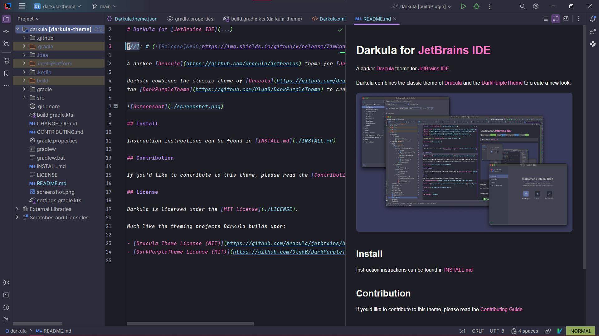
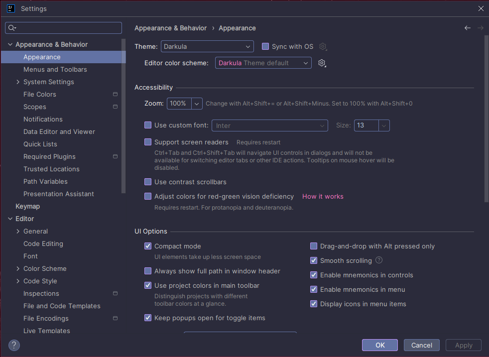
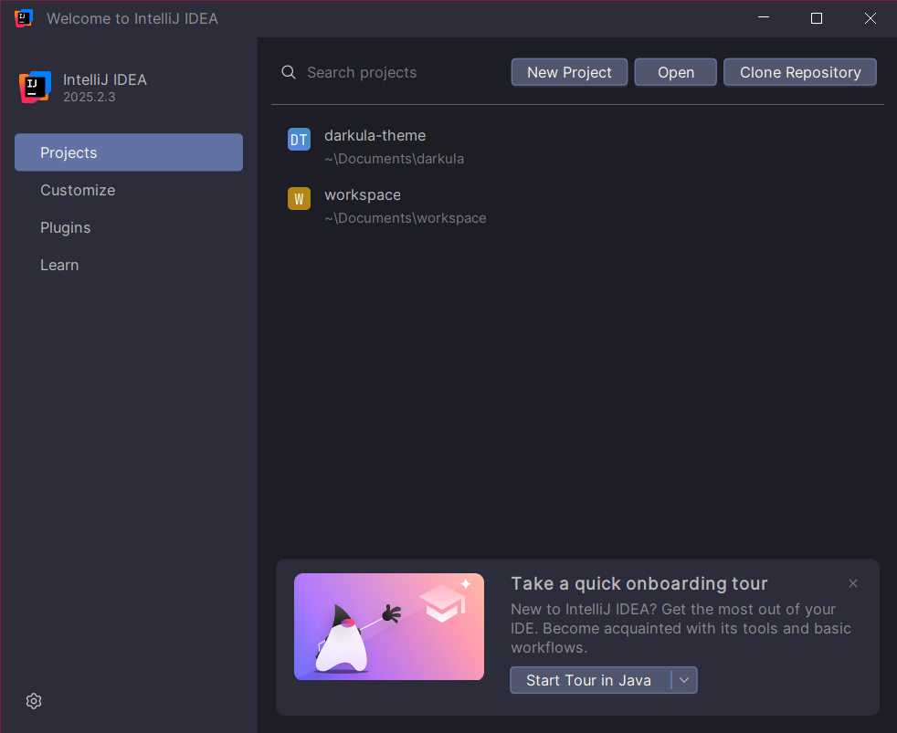

    

 

    <h1>Darkula for <a href="https://www.jetbrains.com/">JetBrains IDE</a></h1>

A darker [Dracula](https://github.com/dracula/jetbrains) theme for [JetBrains IDE](https://www.jetbrains.com/).

Darkula combines the classic theme of [Dracula](https://github.com/dracula/jetbrains) and
the [DarkPurpleTheme](https://github.com/OlyaB/DarkPurpleTheme) to create a new look.

|                       Projects                       |               Settings                |               Welcome               |
|:----------------------------------------------------:|:-------------------------------------:|:-----------------------------------:|
|  |  |  |
## Install

Instruction instructions can be found in [INSTALL.md](./INSTALL.md)

## Contribution

If you'd like to contribute to this theme, please read the [Contributing Guide](./CONTRIBUTING.md).

## License

Darkula is licensed under the [MIT License](./LICENSE).

Much like the theming projects Darkula is built upon:

- [Dracula Theme License (MIT)](https://github.com/dracula/jetbrains/blob/master/LICENSE)
- [DarkPurpleTheme License (MIT)](https://github.com/OlyaB/DarkPurpleTheme/blob/master/LICENSE)
